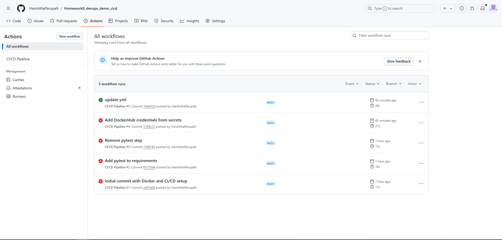

# Homework8 DevOps Demo CI/CD

This project demonstrates a CI/CD pipeline using GitHub Actions to automatically test, build, and push a Docker image to DockerHub. The application is a simple Python "Hello, World!" web server built with Flask.

## Project Overview

The pipeline includes the following steps:
1. **Install Dependencies**: Install Python packages specified in `requirements.txt`.
2. **Docker Login**: Authenticate to DockerHub using secrets.
3. **Build and Push Docker Image**: Build the Docker image and push it to DockerHub.

## Folder Structure

devops_demo_cicd/
├── app.py                 # Main application file
├── requirements.txt       # Project dependencies
├── Dockerfile             # Docker configuration
└── .github/
    └── workflows/
        └── ci_cd.yml      # GitHub Actions workflow file

## Getting Started

### Prerequisites

- Docker
- Python 3.9 or higher
- DockerHub account

### Installation

1. **Clone the repository**:

   
   git clone https://github.com/HarshithaParupalli/homework8_devops_demo_cicd.git
   cd homework8_devops_demo_cicd

2. **Run the application locally**:
	Install the dependencies and start the Flask server.

	python3 -m venv venv
	source venv/bin/activate
	pip install -r requirements.txt
	python app.py

3. **Build and Run with Docker**:
	docker build -t homework8_devops_demo_cicd .
	docker run -p 5000:5000 homework8_devops_demo_cicd

###Access the application at http://localhost:5000

## CI/CD Workflow

The CI/CD pipeline is configured with GitHub Actions in `.github/workflows/ci_cd.yml`. It automatically runs on every push or pull request to the `main` branch.

### Steps

1. **Checkout code** - Retrieves the code from the repository.
2. **Set up Python** - Installs Python 3.9.
3. **Install dependencies** - Installs dependencies listed in `requirements.txt`.
4. **Log in to DockerHub** - Logs into DockerHub using GitHub secrets.
5. **Build and push Docker image** - Builds the Docker image and pushes it to DockerHub.

## DockerHub Image

The Docker image is automatically pushed to DockerHub after a successful build. Below are screenshots showing the published image in DockerHub.

### Screenshots

- **GitHub Actions Workflow Success**:

  

- **DockerHub Image**:
  
  

